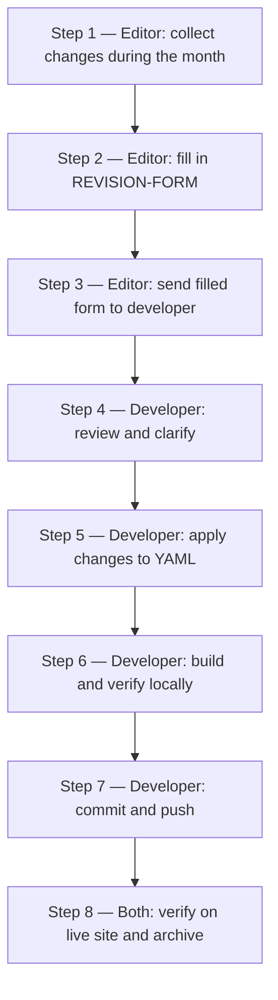

# Update procedure — how monthly updates run

> [!info] What this file is
> The single source of truth for **how** updates to the BR-UK AI Tools
> & Resources Repository get made. Read this first if you're new to the
> workflow. Every monthly update follows the same eight steps below, in
> the same order, by the same two roles. The supporting docs
> ([REVISION-FORM.md](REVISION-FORM.md) and
> [SITE-STRUCTURE.md](SITE-STRUCTURE.md)) plug into specific steps —
> they don't replace this manual.

## Two roles

> [!tip] You only need to read the parts marked with your role
> Each step below is tagged with **🧑‍🔬 Editor** or **🛠 Developer** (or
> both). If your role is editor, you can skip the developer-only steps
> and trust that the developer follows them.

| Role | Who | Reads |
| --- | --- | --- |
| **🧑‍🔬 Editor** — content authority | A behavioural-research lead (e.g. Maggie or Amy) who decides *what* the site should say | UPDATE-PROCEDURE.md (this file) + [REVISION-FORM.md](REVISION-FORM.md) + [SITE-STRUCTURE.md](SITE-STRUCTURE.md) |
| **🛠 Developer** — implementer | The person who edits the YAML files, runs the build, and pushes to GitHub | UPDATE-PROCEDURE.md (this file) + the build/dev appendix in [SITE-STRUCTURE.md](SITE-STRUCTURE.md) |

## When updates happen

| Cadence | Trigger | Turnaround |
| --- | --- | --- |
| **Monthly content refresh** | First week of each month — even with no urgent items, do a sweep for stale links and add anything the editor noticed during the prior month | Apply within ~1 working day of the form arriving |
| **Urgent ad-hoc fix** | A broken link reported by a partner; a factual correction; a publisher policy change | Same day if possible |

> [!tip] Keep a running list during the month
> Don't try to remember everything on the 1st. Keep a draft note in
> Obsidian called `Repository updates — <Month>` and add bullets to it
> whenever something pops up (a colleague mentions a new tool, a link
> 404s, a publisher updates their policy). On the 1st, you transfer the
> bullets into a filled `REVISION-FORM`.

> [!warning] Updates are serial, not parallel
> Run one update at a time, end to end. If an urgent fix has to land
> mid-month while a regular monthly update is already in progress,
> finish the in-progress update (push, verify live, archive) before
> starting the urgent one. Two overlapping updates can step on each
> other's commits and produce silent ripple — see the "Two updates
> landed in the same week" row in the troubleshooting table.

## The procedure at a glance



If a step fails, fix it before moving on — don't skip ahead.

## Step 1 — 🧑‍🔬 Editor: collect changes during the month

Keep a running note as things come up. Don't try to remember on the 1st.

- [ ] Open (or create) an Obsidian note titled `Repository updates — <Month> <Year>`.
- [ ] Each time something needs changing, add one bullet:
    - Page name (e.g. *"1.1 Background Research & Evidence Synthesis"*)
    - One-line description (e.g. *"Elicit description is out of date — update card"*)
    - Optional: paste a link, a screenshot, or the new text right there
- [ ] On the 1st of each month, open the running note and proceed to Step 2.

> [!example] What a running note looks like
> ```
> Repository updates — April 2026
>
> - 1.1 Background Research: Elicit card description is out of date
> - 2.4 Sustainability: Yale article moved, fix the link
> - Section 2 overview: add MIT AI Risk Repository banner box
>   (citation in Zotero, "Slattery 2024")
> - Home: shrink eyebrow text (looks too big after April CSS tweak)
> - 1.4 Data Analysis: typo "quantative" → "quantitative" (heading)
> ```

## Step 2 — 🧑‍🔬 Editor: fill in REVISION-FORM

Convert the running notes into a proper request.

- [ ] Open [REVISION-FORM.md](REVISION-FORM.md) in Obsidian.
- [ ] Scroll to the *Blank form to copy* section near the bottom.
- [ ] Copy everything inside the four-backtick fence into a new note
      (e.g. `Update request — 2026-04-01.md`).
- [ ] Fill in the header: date, your name, one-line reason.
- [ ] For each page in your running note, fill in a `Page:` block with
      Changes/Additions, Deletions, or Format/Layout Notes — see the
      worked example in REVISION-FORM.md for what each looks like.
- [ ] If a change references a screenshot, save the image alongside the
      filled form (same folder) and name it in the `Screenshot:` field.
- [ ] Spot-check the filled form: every page in the running note got an
      entry; no half-finished bullet was missed.

> [!warning] Don't paste secrets
> See REVISION-FORM.md → Tips for the full guidance. Short version: the
> filled form should be safe to email — no passwords, keys, or
> identifiable participant data.

## Step 3 — 🧑‍🔬 Editor: send filled form to developer

- [ ] Send the filled form to the developer (email / Slack / shared
      Obsidian vault — whatever the team uses).
- [ ] Attach any screenshots referenced in the form.
- [ ] Note in the message: `Monthly update for <Month> <Year>` (or
      `URGENT` + one-line reason if it's an ad-hoc fix).
- [ ] Expect a reply within one working day — either *"applied, please
      verify"* or *"clarifying questions before I apply"*.

## Step 4 — 🛠 Developer: review and clarify

The "developer" in this step can be a human, Claude Code, or another AI
assistant. The same rules apply to all three: read the whole form
first, ask before guessing, **always preview the proposed diff before
applying**.

- [ ] Read every edit in the form once, end to end, before touching any
      file.
- [ ] For each ambiguous item, reply to the editor *before* applying.
      Examples:
    - *"Two paragraphs on Sustainability mention the Yale article — do
      you want both fixed or only the Further-reading one?"*
    - *"The new MIT AI Risk Repository box: should it sit above or
      below 'Recommended starting reads'?"*
- [ ] Wait for the editor's clarifications. Don't guess.
- [ ] **🤖 If the implementer is Claude Code or another AI**:
    - Use the prompt in
      [§ Handing the form to Claude Code](#handing-the-form-to-claude-code)
      below. The prompt enforces a diff-preview-then-apply loop and
      surfaces ambiguity early.
    - The editor **must** see and approve the diff before authorising
      the AI to apply it. Don't authorise blind execution — the AI's
      strongest failure mode is silently picking the wrong YAML block
      type when the form is ambiguous.

> [!warning] Never apply a guess (human or AI)
> A guessed edit that turns out wrong has to be unwound, re-discussed,
> and re-applied — three times the work. Asking is always cheaper.

## Step 5 — 🛠 Developer: apply changes to YAML

- [ ] In `content/`, find the YAML file matching each page (use the
      page-id table in [SITE-STRUCTURE.md](SITE-STRUCTURE.md#page-list)).
- [ ] For each `Changes / Additions` entry: edit the relevant block
      (`tool_grid`, `markdown`, `lede`, `callout`, `references`, etc.).
- [ ] For each `Deletions` entry: remove the named block or text.
- [ ] For each `Format / Layout Notes` entry: apply the styling /
      reordering note.
- [ ] Cross-reference: every numbered edit in the form has a
      corresponding YAML change.

> [!tip] Cross-page references use page IDs, not URLs
> When you need a link from one page to another (in a `pager`,
> `subpage_list`, `breadcrumb`, or markdown body), use the page ID
> (e.g. `section-1.literature-review`) so the build can resolve it.
> See SITE-STRUCTURE.md → "Cross-page links use page IDs" in the dev
> appendix.

## Step 6 — 🛠 Developer: build and verify locally

Run these in order. Exact command syntax lives in
[SITE-STRUCTURE.md → Build, preview, commit](SITE-STRUCTURE.md#build-preview-commit)
so it stays in one place; this list owns the **order and intent** of
each step.

- [ ] **Regenerate the HTML** from the edited YAML.
- [ ] **Run the drift check** (`python3 build.py --check`). Must exit
      `0`. This is a fast precondition: if it fails the YAML and HTML
      are out of sync — re-run the build and try again before bothering
      to preview.
- [ ] **Spot-check the rebuilt HTML files**: the ones that should have
      changed, plus one that shouldn't have — to catch accidental
      changes.
- [ ] **Preview locally** (`python3 -m http.server 8080`, then
      `http://localhost:8080/`). Click through every page that should
      have changed and verify the change visually.

> [!warning] If the build fails
> Most failures are bad page-ID refs or YAML syntax errors. The error
> message names the page and the bad key. Fix in the YAML and re-run.
> If you can't resolve it in five minutes, reply to the editor with the
> error and ask whether the request needs reshaping.

## Step 7 — 🛠 Developer: commit and push

- [ ] Stage **the YAML edits and the regenerated HTML together** —
      they must travel as one commit so the live site never sees one
      without the other.
      ```bash
      git add content/ *.html section-1/*.html section-2/*.html
      ```
      (or list specific files explicitly if you only changed a subset).
- [ ] Write a commit message in the standard form:
      ```
      Monthly update YYYY-MM: <one-line summary>

      - <bullet per page changed>
      - <…>
      ```
      Example:
      ```
      Monthly update 2026-04: refresh Elicit card; fix Yale link; add MIT Risk Repo box

      - 1.1 Background Research — refresh the Elicit card description
      - 2.4 Sustainability — fix moved Yale URL
      - Section 2 overview — add MIT AI Risk Repository banner
      - 1.4 Data Analysis — fix "quantative" typo
      ```
- [ ] Push:
      ```bash
      git push origin main
      ```
- [ ] Watch the GitHub Pages build complete. Either refresh the live
      site after about a minute, or open the repository on GitHub and
      click the **Actions** tab to watch the deployment finish (it
      usually takes 10–20 seconds). A green tick means the new content
      is live.
- [ ] **Notify the editor** that the changes are applied — a one-line
      reply ("applied — please verify in Step 8") closes the loop the
      editor was told to expect in Step 3.

## Step 8 — 🧑‍🔬 Editor + 🛠 Developer: verify on the live site and archive

- [ ] Open `https://maggieguanyuyang.github.io/bruk_ai_resource_repository/`.
- [ ] Hard-refresh each page that was changed (Cmd-Shift-R on Mac,
      Ctrl-Shift-R on Windows). If a hard-refresh still shows the old
      content, open the page in a Private / Incognito window — that
      bypasses all caches.
- [ ] **Spot-check one page that should NOT have changed** in this
      update. If it has changed, something rippled accidentally —
      restart from Step 4 with the developer/AI to identify the
      unintended edit.
- [ ] **Cross-check renamed headings.** If any heading text was
      changed in this batch, Cmd-F / Ctrl-F across the live site for
      the OLD heading text. Any remaining occurrence is a stale
      reference (typically in a `quicknav`, `pager`, or `subpage_list`
      label) that needs a follow-up edit.
- [ ] Tick off each numbered item in the original form. If anything is
      missing or wrong, restart from Step 4.
- [ ] **🧑‍🔬 Editor**: save the filled form into the local
      `previous_updates/` folder (gitignored — never committed) using
      the filename pattern `YYYYMMDD_AI_Repository_Updates.md` (e.g.
      `20260401_AI_Repository_Updates.md`). The date alone is unique —
      no need for a per-month counter unless you ship a second update
      in the same calendar day, in which case append `_2`, `_3`, etc.
      Keep the screenshots alongside if any were attached.
- [ ] **Append a "What actually shipped" footer** to the archived form
      so the file accurately records the deployed state, not just what
      was originally requested. This is the single source of truth for
      "what changed in this update" six months later. Format:
      ```
      ----------------------------------------------------------------
      What actually shipped
      ----------------------------------------------------------------
      Commit SHA:    <git rev-parse --short HEAD>
      Pushed at:     <ISO timestamp>
      Pages touched: <list>
      Items deferred (CSS or other follow-up):
        - <one bullet per deferred item, with reason>
      Items dropped after clarification:
        - <if any>
      ```

> [!info] Why archive in `previous_updates/` instead of git?
> Filled forms can contain context, names, or pre-publication thinking
> the team doesn't want public. The folder is in `.gitignore` so it
> stays on the editor's machine. Future monthly updates can reference
> the prior ones for institutional memory.

## What to do when something goes wrong

| Problem | What to do |
| --- | --- |
| **Build fails** with `KeyError: Unknown page ref 'X'` | The YAML is referencing a page ID that doesn't exist. Check the page IDs table in `SITE-STRUCTURE.md`. Likely a typo. |
| **Build fails** with `Missing required key … in <block>` | A block in the YAML is missing a required field (e.g. a `tool_grid` item without `desc`). The error names the page and block. |
| **`python3 build.py --check` returns non-zero after a run** | Means the regenerated HTML differs from what's on disk — usually because someone hand-edited an HTML file. Re-run `python3 build.py` to fix. |
| **`git push` is rejected** ("non-fast-forward", "updates were rejected") | Someone else pushed since you started. Run `git pull --rebase origin main`, resolve any conflicts, re-run `python3 build.py --check`, then push again. |
| **GitHub Pages build fails** (the Actions tab shows a red X for `pages-build-deployment`) | Distinct from a *local* build failure. Click the failed run in the Actions tab to see the log; common causes are an unintended binary file under `assets/`, a broken symlink, or a referenced asset that doesn't exist. Fix in a follow-up commit and push again. |
| **Live site doesn't show the change after 10+ minutes** | Check the GitHub Actions tab for a failed Pages build (see row above). If Actions says success, hard-refresh in the browser — your local browser is probably caching the old version. |
| **An applied change broke something else** | Revert the offending commit (`git revert <sha>` — `<sha>` is the short hash from `git log --oneline -5`), push, verify the live site is clean, then re-do the change correctly. |
| **You authorised an "apply" you shouldn't have** (typo in the diff, wrong block, etc.) | Tell the implementer to revert the YAML edit (`git checkout -- <file>` if not yet committed; `git revert <sha>` if already committed). Then re-do from a fresh diff. |
| **Two updates landed in the same week and stepped on each other** | Run them serially, not in parallel — one update's commit must be pushed and verified live BEFORE the next starts. If they overlapped, the later one will need `git pull --rebase origin main` and possibly conflict resolution; re-run `python3 build.py --check` after the rebase. |
| **The live site shows the new content but an unrelated page now looks wrong** (silent ripple) | This is exactly what Step 8's "spot-check one page that should NOT have changed" catches. If you missed it: identify the bad page, find the commit that introduced the change (`git log --oneline -- <path-to-bad-html>`), revert it, push, re-do correctly. |
| **The editor reports a change you applied looks wrong** | Don't argue — re-read the form, check the wording you used, fix and push. If genuinely ambiguous, send a clarifying question for next time. |
| **The editor sent a request that conflicts with itself** | Reply with the conflict ("Edit 1 says X, Edit 3 says not-X — which one wins?"). Don't try to reconcile silently. |

> [!tip] When in doubt, restart the cycle
> If you've fixed the same step three times and it's still wrong,
> revert any partial changes, send a one-line summary to the editor
> ("hit a snag, will retry tomorrow"), and start fresh next morning.
> The site is a living document — a one-day delay on a content update
> is never worth shipping something half-broken.

## Quick checklist (print this)

Use this if you've read the manual once and just want a memory aid for
each round.

```
Editor
  [ ] Step 1 — running notes throughout the month
  [ ] Step 2 — copy blank form, fill in by page
  [ ] Step 3 — send to developer (with attachments)
  [ ] Step 8 — verify on live site, archive filled form

Developer
  [ ] Step 4 — review form, ask clarifying questions
  [ ] Step 5 — apply changes to content/*.yml
  [ ] Step 6 — build → --check (fast gate) → spot-check HTML → preview
  [ ] Step 7 — commit (YAML + HTML together) → push → notify editor
  [ ] Step 8 — verify on live site
```

## Handing the form to Claude Code

If the implementer of an update is Claude Code (or any other AI
assistant) rather than a human developer, paste the prompt below into a
fresh Claude Code session in the repository's working directory and
attach the filled `REVISION-FORM` plus any screenshots.

The prompt enforces a **diff-preview-then-apply** loop, blocks blind
guesses on ambiguous block types, and runs the build's drift check
after each apply. It also tells the AI which YAML field each form
recipe maps to, so it doesn't have to guess.

> [!warning] Send a preflight line BEFORE pasting the prompt
> Some Claude Code sessions will start editing files before the prompt's
> "show diff first" rule registers. As insurance, send this single
> sentence as your **first** message in the session, *before* you paste
> the prompt below or attach the form:
>
> *"Reply with proposed diffs only — do not edit any file in this repo
> until I reply 'yes apply' for each edit."*
>
> If the AI ever responds by announcing it has already edited a file
> *before* you saw and approved a diff, immediately reply *"revert
> that edit and show me the diff first"* — Claude Code will undo the
> change. Do this every time it skips the gate; consistency is what
> keeps the loop honest.

> [!tip] When the editor reviews the diff
> Look at each `+` and `−` line. Match them against the corresponding
> Edit number in your form. If a change touches more than the one block
> you described — for example, a "Fix a broken link" edit also rewrites
> a paragraph — that's a red flag; reply *"only do the link change"*
> and the AI will revert and retry.

> [!tip] How to phrase your "apply" reply
> Only an unqualified **"yes apply"** authorises the edit. Anything
> qualified — *"yes but smaller"*, *"looks good but also fix the
> typo"*, *"OK, plus rename the heading"* — means the diff is **not**
> approved as-is; the AI will revert (or never apply) and produce a
> revised diff for re-approval. The qualified-approval ambiguity is
> the single most common source of half-applied updates.

### Copy-and-paste prompt for Claude Code

```text
You are implementing a monthly content update for the BR-UK AI Tools &
Resources Repository. Read these documents first:

  1. UPDATE-PROCEDURE.md — the procedure (especially Steps 5–7).
  2. SITE-STRUCTURE.md — page-id → YAML file mapping.
  3. REVISION-FORM.md — the recipes referenced in the filled form.

CRITICAL — diff-preview-then-apply loop:

  • You MUST NOT edit any file in this repository until the editor has
    explicitly replied with the unqualified words "yes apply" for the
    specific diff you most recently showed. Any other reply — silence,
    a question, or a qualified "yes but…" — means the diff is NOT
    approved.
  • If the editor's reply contains conditions, additions, or
    corrections ("yes but make X smaller", "approved, also fix Y"),
    treat that as a revision request: produce a fresh diff for
    re-approval. Do not apply the original diff plus the new
    condition.
  • If you find that you've already edited a file before receiving
    "yes apply", immediately revert that edit (`git checkout -- <file>`
    or undo the Edit) and present the diff for approval.

Then process the attached filled REVISION-FORM. For every edit:

  a. Identify the matching YAML file in `content/` from
     SITE-STRUCTURE.md's page list.
  b. Identify the YAML block to modify using the recipe → YAML mapping
     below. If the form is ambiguous about which block, STOP and ask
     the editor a clarifying question — do not guess.
  c. Show me the proposed diff for that single edit (file path + a few
     lines of before/after context). Wait for unqualified
     "yes apply" before editing the file. See the CRITICAL block
     above for what counts as approval.
  d. After applying the YAML edit, run `python3 build.py` to
     regenerate the matching HTML. Then run `python3 build.py
     --check -q` — it MUST exit 0. (`--check` does not write; it
     verifies that the HTML on disk matches what the YAML would
     produce. If it fails, something is out of sync; stop and
     diagnose.)
  e. Move to the next edit.

When all edits are applied:

  f. Cross-check for unintended ripple: grep for any `quicknav.items`,
     `pager.prev`, `pager.next`, `subpage_list`, or `breadcrumb` entry
     whose `label`/`title` text quotes a heading you renamed in this
     batch. If found, surface the affected file:line and ask whether
     to update.
  g. Show me `git status --short` so I can see which YAML and HTML
     files were touched. Then start `python3 -m http.server 8080` and
     tell me which URLs to spot-check.
  h. Stage YAML and regenerated HTML together; show me the proposed
     commit message in the format documented in Step 7. Wait for
     "yes commit" before running `git commit`.
  i. After I confirm the live site looks right, push to origin.

Hard rules:

  • Don't touch `assets/css/style.css` unless the form's
    Format/Layout Notes EXPLICITLY say "edit the stylesheet" or
    similar. CSS changes need separate authorisation.
  • For Format/Layout Notes that ARE styling-only (e.g. "make it
    smaller", "change the colour", "add more spacing") and have no
    YAML answer, do NOT silently skip them and do NOT invent a YAML
    workaround. Surface them as a labelled "Deferred — needs
    stylesheet authorisation" list at the end of your reply, before
    proposing the commit. The editor decides whether to authorise
    the CSS edit in a follow-up round, defer to a future update, or
    drop the request.
  • Don't touch `templates/*.html` unless the form names a site-wide
    structural change (header, footer, hero shape).
  • Don't introduce new YAML block types not present in build.py's
    `_BLOCK_RENDERERS`. If a request needs a new block type, surface
    it as a question.
  • Don't fabricate URLs, citations, or DOIs. If a citation is missing
    a DOI, ask.
  • For "Add new content" requests with a Box title / Box body /
    Citation, default to the `callout` block unless the form asks for
    a different shape.
  • For partial-quote "old text" that doesn't match exactly, ask
    rather than do a fuzzy match.
  • Don't change a block's `id:` (the anchor slug) unless the form
    names that specific change. Other pages may reference these slugs
    via `quicknav`, `pager`, or `subpage_list` — silent renames break
    cross-page navigation.
  • Don't rename a YAML file under `content/` unless the form names
    that specific change. Page IDs are derived from filenames; renames
    break every cross-page `ref:` that points at the old id.

Recipe → YAML mapping:

  Recipe A — Add a tool         → append to `tool_grid:` list in
                                    the matching content/<page>.yml
  Recipe B — Remove/replace tool→ remove or edit the matching entry
                                    in the same `tool_grid:` list
  Recipe C — Fix a broken link  → search for the old URL in the YAML
                                    file; replace verbatim
  Recipe D — Change wording     → string-replace inside the named
                                    `markdown:` / `lede:` / heading-text
                                    block; the form will quote the
                                    full old text. For "add/change a
                                    hyperlink inside an existing
                                    paragraph", do the string-replace
                                    inside the same `markdown:` block
                                    and preserve surrounding text
                                    verbatim.
  Recipe E — Update lede        → replace the value of `body:` →
                                    first `prose:` → first `lede:` field
                                    on the named page
  Recipe F — Update prev/next   → edit `pager.prev` and/or `pager.next`;
                                    use page-id refs from
                                    SITE-STRUCTURE.md, not URLs
  Recipe G — Update on-page nav → edit the matching `quicknav.items[]`
                                    list (add/remove/rename entries)
  Recipe H — Add new content    → defaults below; ask if uncertain:
                                    – plain section heading + prose →
                                      `h2:` + `markdown:` blocks
                                    – tool grid →
                                      new `tool_grid:` block
                                    – titled box with body + citation →
                                      `callout:` with `heading:` and
                                      `body:` (citation embedded as
                                      markdown link inside `body:`)
                                    – sub-page → new YAML file +
                                      `subpage_list[]` entry on the
                                      section index + pager updates on
                                      adjacent pages
                                    – HOME-PAGE-ONLY structures (these
                                      are top-level keys in
                                      `content/home.yml`, NOT
                                      `_BLOCK_RENDERERS` blocks):
                                        • `hero:` (eyebrow / heading /
                                          lede; the optional `actions:`
                                          list renders hero buttons and
                                          is currently absent)
                                        • `audience:` (the three teal
                                          tiles under the hero; each has
                                          heading, icon SVG, body)
                                        • `explore:` (heading above the
                                          section grid; the optional
                                          `intro:` line is currently
                                          absent)
                                        • `section_cards:` (the six big
                                          cards in the section grid;
                                          to "add another section to
                                          the main page", append a new
                                          entry here)
                                        • `what:` ("The Repository in a
                                          Nutshell" heading + paragraphs)
                                        • `suggest:` (the "Any
                                          suggestions?" box at the very
                                          bottom; a list holding one
                                          `callout` block)
  Recipe I — Site-wide change   → edit `content/_site.yml` (header,
                                    nav, footer text); for the home-
                                    page footer overrides, edit
                                    `content/home.yml` instead
                                    (`footer_about` / `footer_contact`)
  Recipe J — Other              → ask for clarification; describe
                                    your proposed YAML interpretation
                                    and wait for confirmation

After every diff is applied:

  • Re-read the changed YAML file once to spot copy-paste errors.
  • Confirm `python3 build.py --check -q` exits 0.
  • Confirm git status shows expected files only.

If anything in the form references a screenshot you don't have access
to, ask the editor to paste the screenshot into the conversation
before proceeding with that edit.
```

### Why each rule

| Rule | Failure mode it prevents |
| --- | --- |
| Diff preview before edit | Silent wrong-block-type substitution on ambiguous "Add new content" requests |
| Hard stop on partial-quote mismatches | Fuzzy search-and-replace landing in the wrong paragraph |
| Don't touch CSS without authorisation | Layout-style requests in Format/Layout Notes being interpreted as YAML edits |
| Don't fabricate URLs / DOIs | Citation hallucination in `references` blocks |
| Default boxed content to `callout` | Editor's "new banner box" being implemented as a `tool_grid` item |
| Page-id refs in `pager` | Hardcoded relative URLs that break when files move |

## Glossary of files mentioned

- **`UPDATE-PROCEDURE.md`** — this file. The procedure manual.
- **[REVISION-FORM.md](REVISION-FORM.md)** — the empty form the editor
  copies and fills in each month, plus a worked example.
- **[SITE-STRUCTURE.md](SITE-STRUCTURE.md)** — page-by-page reference
  showing what's on each page and which YAML file holds it. Has a
  developer-only appendix at the bottom for build commands and page
  IDs.
- **`previous_updates/`** — local-only folder (gitignored) where filled
  monthly forms are archived for institutional memory.
- **`content/`** — folder of YAML source files, one per page. Edit
  these.
- **`templates/`** — folder of HTML templates. Rarely needs touching;
  only edit when changing site-wide layout.
- **`build.py`** — the Python script that turns YAML into HTML. Run
  with `python3 build.py`.
